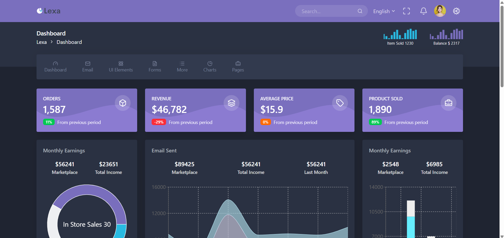

# Dynamic Dashboard Example

Basic responsive dashboard example with dynamic content created with Tailwind CSS. Supports Dark mode.
The website is deployed on [Vercel](https://vercel.com/).  
Website:

